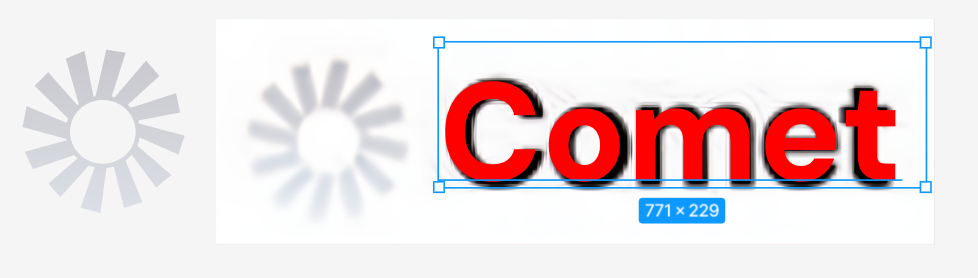

# Nombre del Proyecto

DOMO - Lautaro Paz

## Sobre el Proyecto:

Este proyecto es parte del **Desafío DOMO**. He creado una página web tomando como referencia una imagen seleccionada, aplicando mis habilidades en desarrollo Front End. 

El objetivo de este proyecto es demostrar mi capacidad para estructurar y estilizar interfaces web, así como manejar la interactividad utilizando las herramientas de desarrollo más utilizadas en la industria.

Este proyecto es mi manera de aplicar al puesto de trabajo como **Desarrollador Front End**.

Puedes ver el desafío en el siguiente enlace:  
[DOMO Front End Challenge](https://domofrontendchallenge.netlify.app/challenge)

### Herramientas Utilizadas:

- **HTML5** - Para estructurar las páginas.
- **CSS3** - Para los estilos y la presentación del sitio.
- **Bootstrap** - Para un diseño responsivo.
- **Google Fonts** - Para el uso de la tipografía en toda la página.
- **Figma** - Para crear el logo desde cero, tomando como referencia el existente. Al tener como referencia una foto pixelada, pensé que la mejor opción sería recrearlo para que la página no pierda calidad.

- **Selector de Color & Herramienta Cuentagotas** - Para obtener con exactitud los mismos colores de la página de ejemplo que seleccioné.

> **Nota:** Este proyecto sigue los principios de buenas prácticas de desarrollo web y está optimizado para dispositivos móviles.